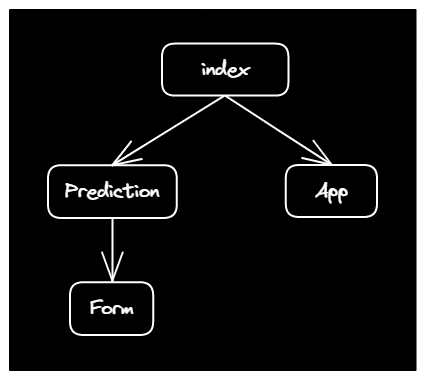

# Contributing to IPL APP

Please [raise an issue](https://github.com/HarshKapadia2/ipl-app/issues) to request a feature/modification or for reporting a bug, if it has not already been raised.

## Tech Stack

-   Client: React.js (Create React App)
-   Server: Flask, `scikit-learn`

## Local Setup

-   Fork this repo. (Top right corner.)
-   Clone the forked repo using the [`git clone` command](https://harshkapadia2.github.io/git_basics/#_git_clone).
-   Navigate (`cd`) to the cloned repo directory (usually `ipl-app`).
-   Client

    -   Navigate (`cd`) to the `client` directory.
    -   Execute `npm install` to install all dependencies.
    -   To make requests to the server, it will have to be run locally (setup instructions below) and the URL of the Fetch API requests will have to be changed to `http://127.0.0.1:<port>/<path>`.

        -   **Do not** forget to revert this change back to the original before committing and pushing.

        Example Fetch API URL: `http://127.0.0.1:5000/predict`

    -   Execute `npm run start` to start the development server.

-   Server

    -   Navigate (`cd`) to the `server` directory.
    -   Execute `virtualenv venv` to create a virtual environment with the name `venv`.
        -   A directory `venv` will be created and it will be ignored by Git.
    -   [Activate the virtual environment `venv`.](https://docs.python.org/3/library/venv.html#:~:text=Once%20a%20virtual%20environment%20has%20been%20created%2C%20it%20can%20be%20%E2%80%9Cactivated%E2%80%9D%20using%20a%20script%20in%20the%20virtual%20environment%E2%80%99s%20binary%20directory.%20The%20invocation%20of%20the%20script%20is%20platform%2Dspecific)
    -   Execute `pip install -r requirements.txt` to install all dependencies.
    -   Replace the **value** of the `Access-Control-Allow-Origin` header with `*` at all places in `main.py` to allow the browser to make cross origin requests from any domain to the development server (CORS).

        -   **Do not** forget to revert these changes back to the original before committing and pushing.

        Example: `response.headers.add("Access-Control-Allow-Origin", "*")`

    -   Execute `py main.py` to start the development server.
        -   Set `debug = True` at the end of the file for a hot reloading development server, otherwise the development server will have to be re-started manually after every change for it to reflect in development.
            -   **Do not** forget to revert this change back to the original (`debug = False`) before committing and pushing.

-   Make contribution(s).
-   Write meaningful commit messages and include the number (#) of the issue being resolved (if any) at the end of the commit message.

    Example: `:bug: fix: Resolve 'isCorrect' function error (#0)`

    [Commit message format](https://harshkapadia2.github.io/git_basics/#_commit_messagetitle)

-   Open a Pull Request (PR).
    -   [Learn how to open a PR.](https://github.com/firstcontributions/first-contributions)
    -   Solve one issue per PR, without any extra changes.
    -   Include extra changes in a separate PR.

## Component Structure

## Further Help

If any further help is needed, do not hesitate to contact the author ([Harsh Kapadia](https://harshkapadia.me)) via Twitter [@harshgkapadia](https://twitter.com/harshgkapadia), [LinkedIn](https://www.linkedin.com/in/harshgkapadia) or e-mail ([contact@harshkapadia.me](mailto:contact@harshkapadia.me)). An [issue](https://github.com/HarshKapadia2/ipl-app/issues) can be raised as well.
